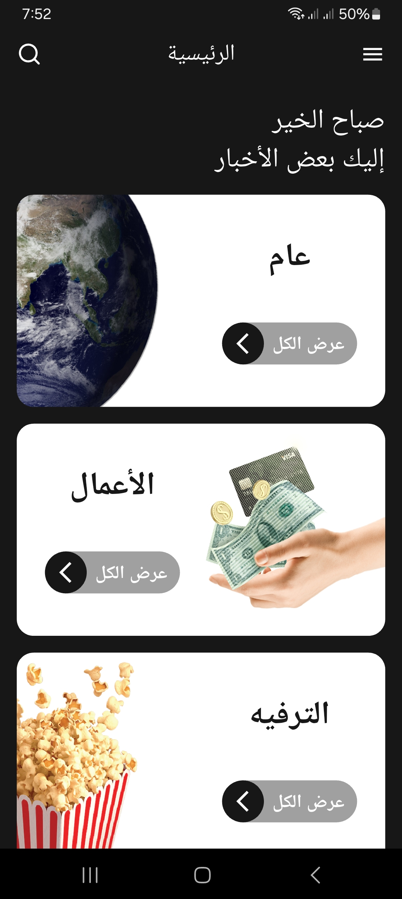
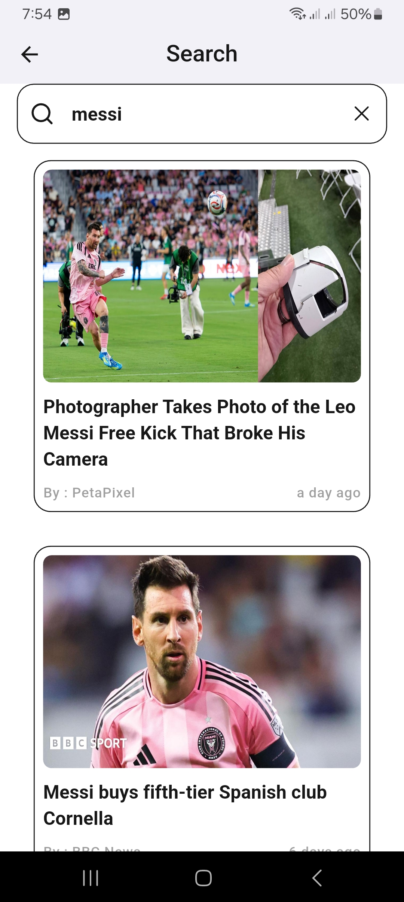
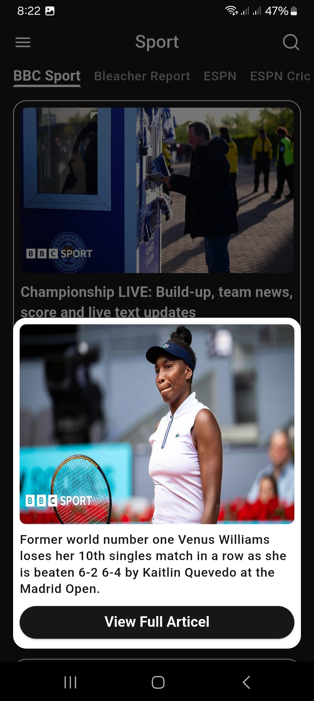

# 📰 News App  

A modern Flutter application that provides real-time news with a smooth UI, search functionality, and infinite scrolling.

---

## ✨ Features  

📰 Browse latest news articles  
🔍 Search news by keywords  
♾️ Infinite scrolling (pagination)  
🌐 Open full articles in browser  
🌙 Light & Dark mode support  
🌍 Multi-language support (Localization)  
💾 Save preferences using SharedPreferences  
⚡ Clean architecture using Bloc & Provider  

---

## 🧠 Architecture (MVVM)

This project follows **MVVM (Model - View - ViewModel)** architecture for better scalability and clean code. 

## 🧩 State Management & Dependency Injection  

This project uses **Cubit (from Bloc)** combined with **Dependency Injection (DI)** to manage state and improve scalability.

---

### 🔹 Cubit (ViewModel)

- Handles business logic  
- Manages UI states (loading, success, error)  
- Keeps UI clean and reactive  


## 📸 Screenshots

<p align="center">
  
  
  
  
  
  
</p>

👉 More Screenshots:
https://drive.google.com/file/d/1p-P0EyrHHs2VJsOaPTFTBLuUmzZmDMRd/view?usp=drive_link

---

## 🎥 Demo Video

👉 Watch the app demo:
https://drive.google.com/file/d/1fSzmweXMGWSAf2Wm0FzqLL8yKnsXIL5U/view?usp=drive_open

---

## 📦 Download APK

👉 Get latest APK:
https://drive.google.com/file/d/18Ud3LCFtJWKm6N_GlIW7IsY5ybL0yMt9/view?usp=drive_link

---

## 🛠️ Tech Stack  

💙 **Flutter** 
🎯 **Dart**  
🌐 **HTTP (API Integration)**  
🧠 **Cubit (Bloc State Management)**  
🧩 **Dependency Injection (get_it)**  
📦 **Provider (App Settings)**  
♾️ **Infinite Scroll Pagination**  
💾 **SharedPreferences (Local Storage)**  
🔐 **Flutter Dotenv (.env)**  
🌍 **Localization**  
🔗 **URL Launcher**  
🎨 **Flutter SVG (UI Icons)** 

### 🔹 Architecture

- 🧱 **MVVM (Model - View - ViewModel)**  
- 🔄 Reactive UI with **Bloc/Cubit**  
- 🧩 Scalable structure using **Dependency Injection** 
---

## 📁 Project Structure  

lib/
├── news/
│ ├── data/
│ ├── view/
│ ├── view_model/
├── sourses/
│ ├── data/
│ ├── view/
│ ├── view_model/
├── shared/
│ ├── providers/
│ ├── services/
├── l10n/

assets/
├── images/
├── icons/


---

## ⚙️ Getting Started

1. Clone the repository:

```bash
git clone https://github.com/A7med22x/news-app.git
```

2. Navigate to project folder:

```bash
cd news-app
```

3. Install dependencies:

```bash
flutter pub get
```

4. Run the app:

```bash
flutter run
```

---

## 🎨 Assets

* Images: `assets/images/`
* Icons: `assets/icons/`

---

## 📱 App Icon & Splash

* Launcher icon configured via `flutter_launcher_icons`
* Splash screen via `flutter_native_splash`

---

## 👨‍💻 Author

Ahmed Abd El-Moniem

---

## 📄 License

This project is for educational purposes.
